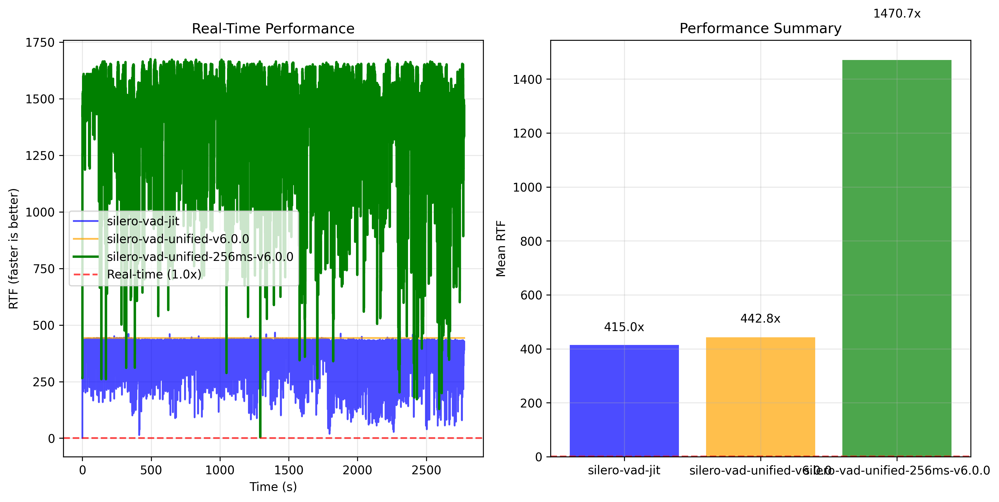
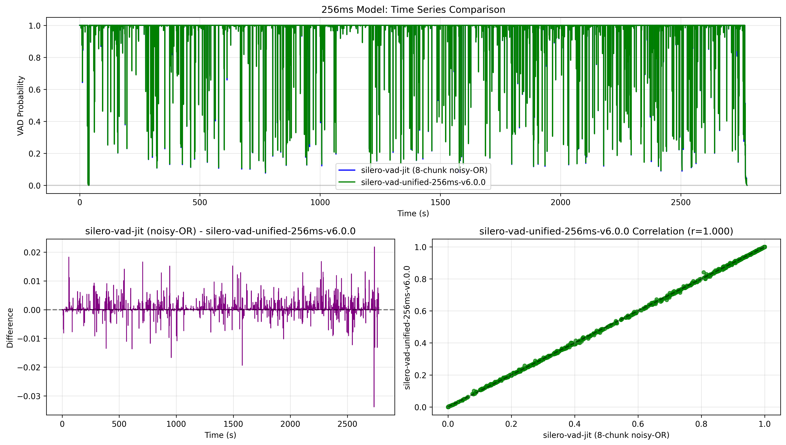

# Benchmarks

2024 MacBook Pro, 48GB Ram, M4 Pro, Tahoe 26.0

## Transcription

https://huggingface.co/FluidInference/parakeet-tdt-0.6b-v3-coreml 

```bash
swift run fluidaudiocli fleurs-benchmark --languages all --samples all
```

```text
Language                  | WER%   | CER%   | RTFx    | Duration | Processed | Skipped
-----------------------------------------------------------------------------------------
Bulgarian (Bulgaria)      | 12.8   | 4.1    | 195.2   | 3468.0s  | 350       | -
Croatian (Croatia)        | 14.0   | 4.3    | 204.9   | 3647.0s  | 350       | -
Czech (Czechia)           | 12.0   | 3.8    | 214.2   | 4247.4s  | 350       | -
Danish (Denmark)          | 20.2   | 7.4    | 214.4   | 10579.1s | 930       | -
Dutch (Netherlands)       | 7.8    | 2.6    | 191.7   | 3337.7s  | 350       | -
English (US)              | 5.4    | 2.5    | 207.4   | 3442.9s  | 350       | -
Estonian (Estonia)        | 20.1   | 4.2    | 225.3   | 10825.4s | 893       | -
Finnish (Finland)         | 14.8   | 3.1    | 222.0   | 11894.4s | 918       | -
French (France)           | 5.9    | 2.2    | 199.9   | 3667.3s  | 350       | -
German (Germany)          | 5.9    | 1.9    | 220.9   | 4684.6s  | 350       | -
Greek (Greece)            | 36.9   | 13.7   | 183.0   | 6862.0s  | 650       | -
Hungarian (Hungary)       | 17.6   | 5.2    | 213.6   | 11050.9s | 905       | -
Italian (Italy)           | 4.0    | 1.3    | 236.7   | 5098.7s  | 350       | -
Latvian (Latvia)          | 27.1   | 7.5    | 217.8   | 10218.6s | 851       | -
Lithuanian (Lithuania)    | 25.0   | 6.8    | 202.8   | 10686.5s | 986       | -
Maltese (Malta)           | 25.2   | 9.3    | 217.4   | 12770.6s | 926       | -
Polish (Poland)           | 8.6    | 2.8    | 190.2   | 3409.6s  | 350       | -
Romanian (Romania)        | 14.4   | 4.7    | 200.4   | 9099.4s  | 883       | -
Russian (Russia)          | 7.2    | 2.2    | 209.7   | 3974.6s  | 350       | -
Slovak (Slovakia)         | 12.6   | 4.4    | 227.6   | 4169.6s  | 350       | -
Slovenian (Slovenia)      | 27.4   | 9.2    | 197.1   | 8173.1s  | 834       | -
Spanish (Spain)           | 4.5    | 2.2    | 221.7   | 4258.9s  | 350       | -
Swedish (Sweden)          | 16.8   | 5.0    | 219.5   | 8399.2s  | 759       | -
Ukrainian (Ukraine)       | 7.2    | 2.5    | 201.9   | 3853.7s  | 350       | -
-----------------------------------------------------------------------------------------
AVERAGE                   | 14.7   | 4.7    | 209.8   | 161819.2 | 14085     | -
```

```text
Dataset: librispeech test-clean
Files processed: 2620
Average WER: 2.5%
Median WER: 0.0%
Average CER: 1.0%
Median RTFx: 139.6x
Overall RTFx: 155.6x (19452.5s / 125.0s)
```

`swift run fluidaudiocli asr-benchmark --max-files all --model-version v2`

Use v2 if you only need English, it is a bit more accurate

```text
--- Benchmark Results ---
   Dataset: librispeech test-clean
   Files processed: 2620
   Average WER: 2.1%
   Median WER: 0.0%
   Average CER: 0.7%
   Median RTFx: 128.6x
   Overall RTFx: 145.8x (19452.5s / 133.4s)
```

### ASR Model Compilation

Core ML first-load compile times captured on iPhone 16 Pro Max and iPhone 13 running the
parakeet-tdt-0.6b-v3-coreml bundle. Cold-start compilation happens the first time each Core ML model
is loaded; subsequent loads hit the cached binaries. Warm compile metrics were collected only on the
iPhone 16 Pro Max run, and only for models that were reloaded during the session.

| Model         | iPhone 16 Pro Max cold (ms) | iPhone 16 Pro Max warm (ms) | iPhone 13 cold (ms) | Compute units               |
| ------------- | --------------------------: | ---------------------------: | ------------------: | --------------------------- |
| Preprocessor  |                        9.15 |                           - |              632.63 | MLComputeUnits(rawValue: 2) |
| Encoder       |                     3361.23 |                      162.05 |             4396.00 | MLComputeUnits(rawValue: 1) |
| Decoder       |                       88.49 |                        8.11 |              146.01 | MLComputeUnits(rawValue: 1) |
| JointDecision |                       48.46 |                        7.97 |               71.85 | MLComputeUnits(rawValue: 1) |

## Transcription with Keyword Boosting

CTC-based custom vocabulary boosting system, which enables accurate recognition of domain-specific terms (company names, technical jargon, proper nouns) without retraining the ASR model.

```bash
# Download the dataset
swift run fluidaudiocli ctc-earnings-benchmark --auto-download

# Run the benchmark
swift run fluidaudiocli ctc-earnings-benchmark

Earnings Benchmark (TDT transcription + CTC keyword spotting)
  Data directory: /Users/<user>/Library/Application Support/FluidAudio/earnings22-kws/test-dataset
  Output file: ctc_earnings_benchmark.json
  TDT version: v2
  CTC model: /Users/<user>/Library/Application Support/FluidAudio/Models/parakeet-ctc-110m-coreml
Loading TDT models (v2) for transcription...
TDT models loaded successfully
Loading CTC models from: /Users/<user>/Library/Application Support/FluidAudio/Models/parakeet-ctc-110m-coreml
Loaded CTC vocabulary with 1024 tokens, variant: Parakeet CTC 110M (hybrid)
Created CTC spotter with blankId=1024
Processing 773 test files...
[  1/772] 4329526_chunk0            WER:  10.3%  Dict: 1/1
[  2/772] 4329526_chunk109          WER:  12.5%  Dict: 2/2
[  3/772] 4329526_chunk118          WER:   3.1%  Dict: 3/3
[  4/772] 4329526_chunk132          WER:   8.1%  Dict: 1/1
[  5/772] 4329526_chunk135          WER:  25.7%  Dict: 1/1
[  6/772] 4329526_chunk16           WER:   8.6%  Dict: 1/1
...
[767/772] 4485206_chunk_86          WER:   5.0%  Dict: 2/2
[768/772] 4485206_chunk_88          WER:   8.3%  Dict: 2/2
[769/772] 4485206_chunk_92          WER:  14.7%  Dict: 4/4
[770/772] 4485206_chunk_97          WER:  30.5%  Dict: 1/1
[771/772] 4485206_chunk_98          WER:  18.6%  Dict: 4/4
[772/772] 4485206_chunk_99          WER:  22.0%  Dict: 1/1

============================================================
EARNINGS22 BENCHMARK (TDT + CTC)
============================================================
Model: /Users/<user>/Library/Application Support/FluidAudio/Models/parakeet-ctc-110m-coreml
Total tests: 771
Average WER: 15.00%
Dict Pass (Recall): 1299/1308 (99.3%)
Vocab Precision: 99.3% (TP=1068, FP=8)
Vocab Recall: 85.2% (TP=1068, FN=185)
Vocab F-score: 91.7%
Total audio: 11564.5s
Total processing: 182.5s
RTFx: 63.36x
============================================================

Results written to: ctc_earnings_benchmark.json
```

In context of vocabulary/keyword detection:

| Metric              | Definition                                                      |
|---------------------|-----------------------------------------------------------------|
| TP (True Positive)  | Word is in reference AND in hypothesis (correctly detected)     |
| FP (False Positive) | Word is in hypothesis but NOT in reference (hallucinated/wrong) |
| FN (False Negative) | Word is in reference but NOT in hypothesis (missed)             |

Derived metrics:

| Metric    | Formula             | Meaning                                              |
|-----------|---------------------|------------------------------------------------------|
| Precision | TP / (TP + FP)      | "Of words we output, how many were correct?"         |
| Recall    | TP / (TP + FN)      | "Of words that should appear, how many did we find?" |
| F-Score   | 2 × P × R / (P + R) | Harmonic mean of precision and recall                |

## Text-to-Speech

We generated the same strings with to generate audio between 1s to ~300s in order to test the speed across a range of varying inputs on Pytorch CPU, MPS, and MLX pipeline, and compared it against the native Swift version with Core ML models.

Each pipeline warmed up the models by running through it once with pesudo inputs, and then comparing the raw inference time with the model already loaded. You can see that for the Core ML model, we traded lower memory and very slightly faster inference for longer initial warm-up.

Note that the Pytorch kokoro model in Pytorch has a memory leak issue: https://github.com/hexgrad/kokoro/issues/152

The following tests were ran on M4 Pro, 48GB RAM, Macbook Pro. If you have another device, please do try replicating it as well!

### Kokoro-82M PyTorch (CPU)

```bash
KPipeline benchmark for voice af_heart (warm-up took 0.175s) using hexgrad/kokoro
Test   Chars    Output (s)   Inf(s)       RTFx       Peak GB
1      42       2.750        0.187        14.737x    1.44
2      129      8.625        0.530        16.264x    1.85
3      254      15.525       0.923        16.814x    2.65
4      93       6.125        0.349        17.566x    2.66
5      104      7.200        0.410        17.567x    2.70
6      130      9.300        0.504        18.443x    2.72
7      197      12.850       0.726        17.711x    2.83
8      6        1.350        0.098        13.823x    2.83
9      1228     76.200       4.342        17.551x    3.19
10     567      35.200       2.069        17.014x    4.85
11     4615     286.525      17.041       16.814x    4.78
Total  -        461.650      27.177       16.987x    4.85    
```

### Kokoro-82M PyTorch (MPS)

I wasn't able to run the MPS model for longer durations, even with `PYTORCH_ENABLE_MPS_FALLBACK=1` enabled, it kept crashing for the longer strings.

```bash
KPipeline benchmark for voice af_heart (warm-up took 0.568s) using pip package
Test   Chars    Output (s)   Inf(s)       RTFx       Peak GB
1      42       2.750        0.414        6.649x     1.41
2      129      8.625        0.729        11.839x    1.54
Total  -        11.375       1.142        9.960x     1.54    
```

### Kokoro-82M MLX Pipeline

```bash
TTS benchmark for voice af_heart (warm-up took an extra 2.155s) using model prince-canuma/Kokoro-82M
Test   Chars    Output (s)   Inf(s)       RTFx       Peak GB
1      42       2.750        0.347        7.932x     1.12
2      129      8.650        0.597        14.497x    2.47
3      254      15.525       0.825        18.829x    2.65
4      93       6.125        0.306        20.039x    2.65
5      104      7.200        0.343        21.001x    2.65
6      130      9.300        0.560        16.611x    2.65
7      197      12.850       0.596        21.573x    2.65
8      6        1.350        0.364        3.706x     2.65
9      1228     76.200       2.979        25.583x    3.29
10     567      35.200       1.374        25.615x    3.37
11     4615     286.500      11.112       25.783x    3.37
Total  -        461.650      19.401       23.796x    3.37
```

#### Swift + Fluid Audio Core ML models

Note that it does take `~15s` to compile the model on the first run, subsequent runs are shorter, we expect ~2s to load. 

```bash
> swift run fluidaudiocli tts --benchmark
...
FluidAudio TTS benchmark for voice af_heart (warm-up took an extra 2.348s)
Test   Chars    Ouput (s)    Inf(s)       RTFx
1      42       2.825        0.440        6.424x
2      129      7.725        0.594        13.014x
3      254      13.400       0.776        17.278x
4      93       5.875        0.587        10.005x
5      104      6.675        0.613        10.889x
6      130      8.075        0.621        13.008x
7      197      10.650       0.627        16.983x
8      6        0.825        0.360        2.290x
9      1228     67.625       2.362        28.625x
10     567      33.025       1.341        24.619x
11     4269     247.600      9.087        27.248x
Total  -        404.300      17.408       23.225

Peak memory usage (process-wide): 1.503 GB
```

## Voice Activity Detection

Model is nearly identical to the base model in terms of quality, performance wise we see an up to ~3.5x improvement compared to the silero Pytorch VAD model with the 256ms batch model (8 chunks of 32ms)




Dataset: https://github.com/Lab41/VOiCES-subset

```text
swift run fluidaudiocli vad-benchmark --dataset voices-subset --all-files --threshold 0.85
...
Timing Statistics:
[18:56:31.208] [INFO] [VAD]    Total processing time: 0.29s
[18:56:31.208] [INFO] [VAD]    Total audio duration: 351.05s
[18:56:31.208] [INFO] [VAD]    RTFx: 1230.6x faster than real-time
[18:56:31.208] [INFO] [VAD]    Audio loading time: 0.00s (0.6%)
[18:56:31.208] [INFO] [VAD]    VAD inference time: 0.28s (98.7%)
[18:56:31.208] [INFO] [VAD]    Average per file: 0.011s
[18:56:31.208] [INFO] [VAD]    Min per file: 0.001s
[18:56:31.208] [INFO] [VAD]    Max per file: 0.020s
[18:56:31.208] [INFO] [VAD]
VAD Benchmark Results:
[18:56:31.208] [INFO] [VAD]    Accuracy: 96.0%
[18:56:31.208] [INFO] [VAD]    Precision: 100.0%
[18:56:31.208] [INFO] [VAD]    Recall: 95.8%
[18:56:31.208] [INFO] [VAD]    F1-Score: 97.9%
[18:56:31.208] [INFO] [VAD]    Total Time: 0.29s
[18:56:31.208] [INFO] [VAD]    RTFx: 1230.6x faster than real-time
[18:56:31.208] [INFO] [VAD]    Files Processed: 25
[18:56:31.208] [INFO] [VAD]    Avg Time per File: 0.011s
```

```text
swift run fluidaudiocli vad-benchmark --dataset musan-full --num-files all --threshold 0.8
...
[23:02:35.539] [INFO] [VAD] Total processing time: 322.31s
[23:02:35.539] [INFO] [VAD] Timing Statistics:
[23:02:35.539] [INFO] [VAD] RTFx: 1220.7x faster than real-time
[23:02:35.539] [INFO] [VAD] Audio loading time: 1.20s (0.4%)
[23:02:35.539] [INFO] [VAD] VAD inference time: 319.57s (99.1%)
[23:02:35.539] [INFO] [VAD] Average per file: 0.160s
[23:02:35.539] [INFO] [VAD] Total audio duration: 393442.58s
[23:02:35.539] [INFO] [VAD] Min per file: 0.000s
[23:02:35.539] [INFO] [VAD] Max per file: 0.873s
[23:02:35.711] [INFO] [VAD] VAD Benchmark Results:
[23:02:35.711] [INFO] [VAD] Accuracy: 94.2%
[23:02:35.711] [INFO] [VAD] Precision: 92.6%
[23:02:35.711] [INFO] [VAD] Recall: 78.9%
[23:02:35.711] [INFO] [VAD] F1-Score: 85.2%
[23:02:35.711] [INFO] [VAD] Total Time: 322.31s
[23:02:35.711] [INFO] [VAD] RTFx: 1220.7x faster than real-time
[23:02:35.711] [INFO] [VAD] Files Processed: 2016
[23:02:35.711] [INFO] [VAD] Avg Time per File: 0.160s
[23:02:35.744] [INFO] [VAD] Results saved to: vad_benchmark_results.json
```

## SenseVoice

Non-autoregressive multilingual ASR using SenseVoiceSmall (FunASR, ~234M) converted to CoreML — SANM encoder + single CTC head, all tokens in one forward pass. See [ASR/SenseVoice.md](ASR/SenseVoice.md) for the architecture and conversion notes.

Model: [FluidInference/sensevoice-small-coreml](https://huggingface.co/FluidInference/sensevoice-small-coreml)

Hardware: Apple M5 Pro, macOS 26. FP16 encoder on the Neural Engine (`CPU_AND_NE`); FP32 CPU front-end. Full canonical test sets, directly comparable to the published [SenseVoice-Small results](https://github.com/FunAudioLLM/SenseVoice).

### LibriSpeech test-clean (2620 files)

| Metric | CoreML (ANE) | Official SenseVoice-Small |
|--------|--------------|---------------------------|
| WER (Avg) | **3.22%** | ~3.1% |
| Median RTFx | 299x | — |

### AISHELL-1 Chinese (7176 files)

| Metric | CoreML (ANE) | Official SenseVoice-Small |
|--------|--------------|---------------------------|
| CER (Avg) | **3.09%** | ~2.9% |
| Median RTFx | 382x | — |

### int8 encoder variant (`--int8`)

Post-training weight quantization of the encoder — **~half the size, accuracy-neutral** vs fp16 (run on ANE). Full canonical test sets:

| | size | LibriSpeech WER | AISHELL CER | peak RAM |
|---|------|-----------------|-------------|----------|
| fp16 (default) | 447 MB | 3.22% | 3.09% | 0.54 GB |
| **int8** | **225 MB** | **3.25%** | **3.09%** | **0.32 GB** |

(Δ +0.03 pp / 0.00 pp on the full LibriSpeech test-clean (2,620) / AISHELL-1 test (7,176), 0 NaN.) int4 per-tensor palettization wrecks accuracy (WER 31%) and is not shipped.

**Methodology notes:**
- CER (character-level, whitespace removed) is the primary metric for Chinese, matching the official SenseVoice chart (AISHELL-1 test).
- Both numbers reproduce the published SenseVoice-Small results, confirming the CoreML conversion (front-end + encoder + decode) is faithful.
- CoreML↔PyTorch parity additionally verified on FLEURS: en WER Δ +0.00pp, zh CER Δ −0.03pp (100 samples/lang).
- The FP16 encoder is correct only on the Neural Engine (NaN on the CPU/GPU FP16 path); non-ANE hardware uses the `--fp32` build. See [ASR/SenseVoice.md](ASR/SenseVoice.md#conversion-notes--findings).
- AISHELL-1 dataset: [TwinkStart/AISHELL-1](https://huggingface.co/datasets/TwinkStart/AISHELL-1).

```bash
# FLEURS WER/CER (in-repo, multilingual)
swift run -c release fluidaudiocli sensevoice-benchmark --languages en_us,cmn_hans_cn --samples all
```

## Paraformer

Non-autoregressive Mandarin (zh) ASR: SANM encoder + CIF predictor (host
integrate-and-fire) + parallel decoder. See [ASR/Paraformer.md](ASR/Paraformer.md).

Model: [FluidInference/paraformer-large-zh-coreml](https://huggingface.co/FluidInference/paraformer-large-zh-coreml)

Hardware: Apple M5 Pro, macOS 26. Encoder/CifAlphas/decoder on ANE; FP32 CPU front-end.

### AISHELL-1 Chinese (7176 files, full test, full-CoreML pipeline)

| Precision | size (enc+dec) | CER | median RTFx | peak RAM | Official |
|-----------|----------------|-----|-------------|----------|----------|
| fp16 (default) | 411 MB | **2.12%** | 85× | 0.38 GB | ~1.95% |
| int8 | 207 MB | **2.12%** | 84× | 0.24 GB | ~1.95% |

**Methodology notes:**
- CER (character-level, whitespace removed) is the primary metric for Chinese, matching the official Paraformer-large AISHELL-1 number.
- int8 weight quantization (encoder + decoder) is accuracy-neutral (CER unchanged on the full set), ~half the size/memory.
- The ~0.17 pp gap vs official is fp16 + the fixed-shape decoder (enc 512 / tokens 128). RTFx (~85×) is lower than SenseVoice (~400×) because Paraformer runs 3 CoreML predicts/clip + the decoder pads short clips to 512 frames — an enumerated decoder would raise it.
- AISHELL-1 dataset: [TwinkStart/AISHELL-1](https://huggingface.co/datasets/TwinkStart/AISHELL-1).

```bash
swift run -c release fluidaudiocli paraformer-transcribe audio.wav         # fp16
swift run -c release fluidaudiocli paraformer-transcribe audio.wav --int8  # half size
```

## Streaming ASR (Parakeet EOU)

Real-time streaming ASR with End-of-Utterance detection using the Parakeet EOU 120M CoreML model.

Model: [FluidInference/parakeet-realtime-eou-120m-coreml](https://huggingface.co/FluidInference/parakeet-realtime-eou-120m-coreml)

Hardware: Apple M2, 2022, macOS 26

### LibriSpeech test-clean (2620 files, 5.40h audio)

| Chunk Size | WER (Avg) | Median WER | RTFx | Total Time |
|------------|-----------|------------|------|------------|
| 320ms      | 4.88%     | 0.00%      | 19.25x | 1015s (16.9m) |
| 160ms      | 8.23%     | 5.26%      | 5.78x  | 3387s (56.4m) |


```bash
# Run 320ms benchmark
swift run -c release fluidaudiocli parakeet-eou --benchmark --chunk-size 320 --use-cache

# Run 160ms benchmark
swift run -c release fluidaudiocli parakeet-eou --benchmark --chunk-size 160 --use-cache
```

## Streaming ASR (Nemotron, English)

NVIDIA's Nemotron Speech Streaming 0.6B for streaming ASR. The default tier is now
**2240ms with B1-fused decode** (decoder+joint merged into one CoreML call per step) —
it trades ~1.1 s of chunk latency for throughput at no accuracy cost. Pass an explicit
`NemotronChunkSize` / `--chunk` (1120/560/160/80) for lower-latency tiers.

Model: [FluidInference/nemotron-speech-streaming-en-0.6b-coreml](https://huggingface.co/FluidInference/nemotron-speech-streaming-en-0.6b-coreml)

Hardware: Apple M5 Pro, macOS 26.5. Encoder int8 on ANE (`.cpuAndNeuralEngine`).

### LibriSpeech test-clean (100 files)

Three tiers, all from one conversion with B1-fused decode (`decoder_joint.mlmodelc`):

| Tier | WER | RTFx | Δ vs 1120ms |
|------|-----|------|-------------|
| 560ms | 2.28% | 42.1 | −35% |
| 1120ms | 2.28% | 65.0 | — |
| **2240ms (default)** | **2.46%** | **93.6** | **+44%** |

WER is neutral across tiers (within n=100 noise). 2240ms = 2× the trained 14-encoder-frame
chunk (the chunked-attention mask still tiles cleanly); B1 fusion = one CoreML call per
decode step instead of two (~+15% on any tier shipping `decoder_joint.mlmodelc`). The v1
160ms/80ms tiers were removed (off-tiling, degraded WER).

**Encoder optimization notes (M5 Pro):**
- **6-bit palettization beats int8** on every axis — 2.24% WER, +9% RTFx, smaller (422 MB vs
  564 MB). Planned follow-up to replace the shipped int8 encoder.
- **Encoder placement / iOS:** ANE gives the fastest inference but slowest load (the iOS
  ~1.4 GB / ~130 s residency wall for the 24-layer encoder). On iOS, running the encoder on
  **CPU** (instant load, ~140 MB, ~66 RTFx) is ~2× faster than 4-way ANE sharding (~33 RTFx)
  — so CPU, not sharding, is the iOS encoder choice. macOS / plugged-in stays on ANE.

> All three tiers are a faithful conversion of the public `nvidia/nemotron-speech-streaming-en-0.6b`
> checkpoint (decoder & joint match PyTorch at cos=1.0) and replace the previous v1 tiers. WER
> parity against NVIDIA's internal tuning of the same model is a tracked follow-up; the ladder
> above is internally consistent (one conversion for all tiers) and reports the relative gains.

```bash
# Default (2240ms + B1)
swift run -c release fluidaudiocli nemotron-benchmark --max-files 100

# Lower-latency tier
swift run -c release fluidaudiocli nemotron-benchmark --chunk 1120 --max-files 100
```

## Streaming ASR (Nemotron Multilingual)

NVIDIA's Nemotron 3.5 ASR Streaming Multilingual 0.6B — real-time streaming RNN-T
covering ~40 language-locales, fully on-device. Two models share one encoder per
tier: `latin` (en/es/fr/it/pt/de, 2,828-token script-pruned vocab) and
`multilingual` (zh/ja + 100+ via `prompt_id`, full 13,087 vocab).

Model: [FluidInference/Nemotron-3.5-ASR-Streaming-Multilingual-0.6b-CoreML](https://huggingface.co/FluidInference/Nemotron-3.5-ASR-Streaming-Multilingual-0.6b-CoreML)

Hardware: Apple M5 Pro, macOS 26.5. Encoder/decoder/joint on ANE
(`.cpuAndNeuralEngine`), CoreML iOS 17 target. Per-file sum-aggregate RTFx, 2.24 s
(2240 ms) tier, B1 fused decode.

### LibriSpeech test-clean (English, 2620 files, 5.40h audio)

| Model | Vocab | WER | RTFx |
|-------|-------|-----|------|
| `latin` | 2,828 | 3.6% | 124x |
| `multilingual` | 13,087 | 3.2% | 76x |

`latin` is ~1.6× faster than the full-vocab model on the same English audio
(smaller per-frame joint matmul) at ~0.4 pp WER. English WER uses the HF
`EnglishTextNormalizer` (Open ASR Leaderboard convention).

### FLEURS (full test splits, 2.24 s tier)

| Language | Model | WER / CER | RTFx |
|----------|-------|-----------|------|
| English (en) | `latin` | 8.96% | 130x |
| Spanish (es) | `latin` | 4.80% | 140x |
| French (fr) | `latin` | 9.52% | 130x |
| Italian (it) | `latin` | 5.41% | 147x |
| Portuguese (pt) | `latin` | 6.14% | 141x |
| German (de) | `latin` | 9.83% | 144x |
| Chinese (zh) | `multilingual` | 18.57% CER | 89x |
| Japanese (ja) | `multilingual` | 13.79% CER | 84x |

FLEURS is multi-domain and digit-bearing, so it runs higher than test-clean for
the same model. Reference and hypothesis are normalized with
[`text-processing-rs`](https://github.com/FluidInference/text-processing-rs) —
FluidInference's Rust port of NVIDIA NeMo's (inverse) text-normalization grammars
(~98.6% NeMo-suite compatibility) — to match NVIDIA's FLEURS scoring; zh/ja are
scored as CER. (The `nemotron-multilingual-benchmark` CLI's built-in scorer uses
a lighter Swift normalizer, so non-English numbers it prints may differ slightly
from these.) The full-vocab `multilingual` model is chunk-sensitive — use the 2 s
tier for zh/ja.

```bash
# LibriSpeech test-clean (English)
swift run -c release fluidaudiocli nemotron-multilingual-benchmark \
  --dataset librispeech --librispeech-subset test-clean --model-dir <model-dir>

# FLEURS per-language
swift run -c release fluidaudiocli nemotron-multilingual-benchmark \
  --dataset fleurs --languages en_us,es_419,fr_fr,it_it,pt_br,de_de,cmn_hans_cn,ja_jp \
  --model-dir <model-dir>
```

## Speaker Diarization

Both offline and online versions use the community-1 model (via FluidInference/speaker-diarization-coreml).

### Offline diarization pipeline

For slightly ~1.2% worse DER we default to a higher step ratio segmentation duration than the baseline community-1 pipeline. This allows us to get nearly ~2x the speed (as expected because we're processing 1/2 of the embeddings). For highly critical use cases, one may should use step ratio = 0.1 and minSegmentDurationSeconds = 0.0

Running on the full voxconverse benchmark:

```bash
StepRatio = 0.2, minSegmentDurationSeconds= 1.0
Average DER: 15.07% | Median DER: 10.70% | Average JER: 39.40% | Median JER: 40.95% (collar=0.25s, ignoreOverlap=True)
Average RTFx: 122.06 (from 232 clips)
Completed. New results: 232, Skipped existing: 0, Total attempted: 232
Step Ratio 2, min duration 1.0


StepRatio = 0.1, minSegmentDurationSeconds= 0
Average DER: 13.89% | Median DER: 10.49% | Average JER: 42.84% | Median JER: 43.30% (collar=0.25s, ignoreOverlap=True)
Average RTFx: 64.75 (from 232 clips)
Completed. New results: 232, Skipped existing: 0, Total attempted: 232
Step Ratio 1, min duration 0 (edited) 
```

Note that the baseline pytorch version is ~11% DER, we lost some precision dropping down to fp16 precision in order to run most of the embedding model on neural engine. But as a result, we significantly out perform the baseline `mps` backend as well. the pyannote-community-1 on cpu is ~1.5-2 RTFx, on mps, it's ~20-25 RTFx.

Running on the full AMI SDM 16-meeting test set (official NeMo/pyannote evaluation split: EN2002, ES2004, IS1009, TS3003 × a-d):

```bash
swift run -c release fluidaudiocli diarization-benchmark --mode offline \
    --dataset ami-sdm --auto-download
```

```text
------------------------------------------------------------------------------------------
Meeting        DER %    JER %    Miss %     FA %     SE %   Speakers     RTFx
------------------------------------------------------------------------------------------
IS1009c           5.1      5.9      3.1      1.5      0.6     4/4        94.6
IS1009b           5.4      6.4      2.8      1.4      1.1     4/4        77.6
ES2004b           6.0      7.0      2.7      2.2      1.1     4/4        70.4
ES2004c           6.4      7.3      2.0      3.4      1.0     4/4        70.5
EN2002c           7.8      9.7      5.1      0.5      2.2     3/3        60.3
TS3003b           8.0      7.8      3.6      3.7      0.7     4/4        71.4
TS3003c           9.0      8.7      6.1      1.9      0.9     4/4        70.4
EN2002b           9.1     12.9      4.0      1.9      3.2     5/4        63.4
IS1009d           9.2     11.7      4.5      2.6      2.2     4/4        91.6
IS1009a           9.9     11.9      5.0      2.5      2.4     4/4        60.8
ES2004a          10.4     13.4      7.5      1.6      1.4     4/4        60.0
EN2002a          10.6     15.0      5.4      1.2      4.0     4/4        52.2
ES2004d          11.4     16.4      5.3      2.6      3.5     4/4        62.1
TS3003a          17.2     64.1     13.1      1.3      2.8     2/4        68.7
EN2002d          18.3     38.2      4.6      1.5     12.2     3/4        78.6
TS3003d          26.0     41.6     11.0      2.2     12.8     3/4        64.5
------------------------------------------------------------------------------------------
AVERAGE          10.6     17.4      5.4      2.0      3.3      -         69.8
==========================================================================================
```

12/16 meetings detect the correct speaker count. Average DER 10.62% matches published pyannote-community-1 offline numbers on this split (~11-12%).

### Streaming/online Diarization

This is more tricky and honestly a lot more fragile to clustering. Expect +10-15% worse DER for the streaming implementation. Only use this when you critically need realtime streaming speaker diarization. In most cases, offline is more than enough for most applications.

Running a near real-time diarization benchmark for 3s chunks, 1s overlap, and 0.85 clustering threshold:
```bash
swift run fluidaudiocli diarization-benchmark --mode streaming \
    --dataset ami-sdm \
    --threshold 0.85 \
    --auto-download \
    --chunk-seconds 3.0 \
    --overlap-seconds 1.0
    
...

------------------------------------------------------------------------------------------
Meeting        DER %    JER %    Miss %     FA %     SE %   Speakers     RTFx
------------------------------------------------------------------------------------------
ES2004a          31.6     41.6      6.7      2.1     22.7     7/4        49.8
ES2005a          39.7     65.0      6.9      7.3     25.5     5/4        59.1
IS1002b          40.4     51.3      1.1      5.2     34.1     9/4        45.3
ES2002a          41.5     56.0      5.3     10.1     26.1     6/4        48.6
ES2003a          53.1     78.7      5.3      2.3     45.5     5/4        57.1
IS1000a          66.7     74.0      6.1      7.6     53.0     7/4        50.7
IS1001a          75.0     88.6      7.1      4.7     63.2     10/4       48.8
------------------------------------------------------------------------------------------
AVERAGE          49.7     65.0      5.5      5.6     38.6      -         51.4
==========================================================================================
```


Diarization benchmark with 10s chunks, 0s overlap, and 0.7 clustering threshold:
```bash
swift run fluidaudiocli diarization-benchmark --mode streaming \
    --dataset ami-sdm
    --threshold 0.7
    --auto-download
    --chunk-seconds 10.0
    --overlap-seconds 0.0

...

------------------------------------------------------------------------------------------
Meeting        DER %    JER %    Miss %     FA %     SE %   Speakers     RTFx
------------------------------------------------------------------------------------------
ES2003a          12.0     19.5      6.9      1.2      3.9 4/4           477.0
ES2004a          15.1     24.8      9.2      1.2      4.7 4/4           367.4
ES2002a          17.8     26.8      8.6      5.8      3.4 6/4           356.8
IS1002b          38.0     41.8      3.1      3.1     31.8 5/4           361.9
ES2005a          22.5     36.8      7.7      6.8      8.0 4/4           460.8
IS1000a          57.7     80.6     11.9      3.9     41.9 8/4           352.1
IS1001a          70.1     85.4     11.2      2.4     56.5 7/4           370.9
------------------------------------------------------------------------------------------
AVERAGE          33.3     45.1      8.4      3.5     21.5         -     392.4
==========================================================================================
```


Diarization benchmark with 5s chunks, 0s overlap, and 0.8 clustering threshold (best configuration found):
```bash
swift run fluidaudiocli diarization-benchmark --mode streaming \
    --dataset ami-sdm
    --threshold 0.8
    --auto-download
    --chunk-seconds 5.0
    --overlap-seconds 0.0

...

------------------------------------------------------------------------------------------
Meeting        DER %    JER %    Miss %     FA %     SE %   Speakers     RTFx
------------------------------------------------------------------------------------------
IS1002b           9.8     11.7      3.5      3.8      2.6      5/4       205.2
ES2003a          14.4     23.3      7.4      1.6      5.3      4/4       260.9
ES2004a          17.0     26.0      9.0      1.3      6.7      7/4       218.1
ES2005a          18.4     31.0      9.2      5.8      3.4      4/4       259.8
ES2002a          20.8     30.5      9.5      7.4      3.9      5/4       198.0
IS1000a          24.7     35.7     12.1      4.3      8.3      6/4       204.2
IS1001a          78.0     94.5     13.3      3.0     61.6      6/4       215.7
------------------------------------------------------------------------------------------
AVERAGE          26.2     36.1      9.2      3.9     13.1       -        223.1
==========================================================================================
```


Diarization benchmark with 5s chunks, 2s overlap, and 0.8 clustering threshold:
```bash
swift run fluidaudiocli diarization-benchmark --mode streaming \
    --dataset ami-sdm
    --threshold 0.8
    --auto-download
    --chunk-seconds 5.0
    --overlap-seconds 2.0

...

------------------------------------------------------------------------------------------
Meeting        DER %    JER %    Miss %     FA %     SE %   Speakers     RTFx
------------------------------------------------------------------------------------------
ES2003a          24.5     42.1      4.7      1.9     18.0     6/4        81.4
ES2005a          27.5     50.6      5.5      7.6     14.4     5/4        76.8
ES2004a          31.6     54.8      6.4      2.3     23.0     5/4        66.9
IS1002b          39.6     57.0      0.8      5.1     33.7     6/4        63.7
ES2002a          41.1     57.2      4.7      9.8     26.7     5/4        65.5
IS1000a          57.4     54.2      6.1      7.7     43.6     9/4        67.2
IS1001a          79.0     86.8      7.0      5.0     66.9     10/4       64.5
------------------------------------------------------------------------------------------
AVERAGE          43.0     57.5      5.0      5.6     32.3      -         69.4
==========================================================================================
```

## Sortformer Streaming Diarization

NVIDIA's Sortformer model for streaming speaker diarization, converted to CoreML.

Model: [FluidInference/diar-streaming-sortformer-coreml](https://huggingface.co/FluidInference/diar-streaming-sortformer-coreml) (V2 models for macOS 26+ compatibility)

Hardware: Apple M2, 2022, macOS 26.1

### AMI SDM Dataset (NVIDIA High-Latency Config - 30.4s chunks)

```bash
swift run fluidaudiocli sortformer-benchmark --nvidia-high-latency --hf --auto-download
```

```text
================================================================================
SORTFORMER BENCHMARK SUMMARY
================================================================================
Results Sorted by DER:
----------------------------------------------------------------------
Meeting        DER %    Miss %     FA %     SE %   Speakers     RTFx
----------------------------------------------------------------------
IS1009b          16.4     10.6      0.6      5.3 4/4           127.0
ES2004c          23.8     17.8      0.3      5.7 4/4           126.5
ES2004b          23.9     18.7      0.2      5.0 4/4           123.9
IS1009a          26.5     16.0      1.4      9.1 4/4           134.4
ES2004d          28.3     19.7      0.3      8.3 4/4           123.5
IS1009d          29.1     16.5      1.0     11.6 4/4           127.9
TS3003b          31.1     27.1      0.6      3.4 4/4           125.5
EN2002c          31.8     20.1      0.2     11.5 4/3           126.0
ES2004a          33.7     24.6      0.1      9.0 4/4           127.2
EN2002b          34.0     20.2      0.6     13.3 4/4           127.7
TS3003c          34.4     31.1      0.3      3.1 4/4           126.6
EN2002a          35.6     20.0      0.4     15.2 4/4           125.4
EN2002d          37.1     20.1      0.5     16.5 4/4           125.5
IS1009c          38.1     12.8      0.9     24.4 4/4           129.2
TS3003d          41.0     32.0      0.1      8.8 4/4           125.6
TS3003a          41.8     36.8      0.7      4.3 4/4           125.7
----------------------------------------------------------------------
AVERAGE          31.7     21.5      0.5      9.7         -     126.7
======================================================================
```

## LS-EEND Streaming Diarization
A research prototype from Westlake University for streaming speaker diarization.

Model: [FluidInference/lseend-coreml](https://huggingface.co/FluidInference/lseend-coreml).

Hardware: Apple M4 MAX, 2026, macOS 26.1 (CPU only)

### AMI SDM Dataset (AMI variant, `--step-size 500ms`)

Each LS-EEND CoreML bundle is keyed by `(variant, stepSize)`. The run below uses the `.ami` variant with `.step500ms`, which commits 5 output frames (~500 ms) per CoreML call.

```bash
swift run fluidaudiocli lseend-benchmark --variant ami --step-size 500ms --auto-download
```

```text
================================================================================
LS-EEND BENCHMARK SUMMARY
================================================================================
Results Sorted by DER:
----------------------------------------------------------------------
Meeting        DER %    Miss %     FA %     SE %   Speakers     RTFx
----------------------------------------------------------------------
ES2004c           8.8      7.2      1.3      0.4     4/4        72.4
ES2004b           8.9      7.3      1.0      0.7     4/4        75.6
TS3003c          13.3     11.1      0.9      1.3     4/4        72.2
IS1009d          13.8      7.9      2.1      3.8     4/4        74.8
TS3003b          16.2      5.9      1.6      8.8     4/4        73.0
TS3003a          19.0     16.6      0.8      1.6     4/4        77.0
EN2002b          20.4     16.0      1.7      2.8     4/4        75.9
TS3003d          20.5     14.7      1.9      3.9     4/4        72.1
IS1009c          22.1      6.8      2.0     13.4     4/4        74.4
EN2002c          23.2     16.6      1.9      4.7     4/3        69.9
IS1009a          23.3      7.9      2.7     12.7     4/4        81.8
EN2002a          24.4     19.6      1.1      3.7     4/4        73.2
IS1009b          25.7      4.8      1.7     19.2     4/4        74.9
ES2004d          27.7     15.1      1.5     11.2     4/4        73.1
EN2002d          27.9     21.9      2.2      3.7     4/4        73.2
ES2004a          35.6     13.4     19.1      3.0     4/4        78.1
----------------------------------------------------------------------
AVERAGE          20.7     12.1      2.7      5.9          -     74.5
======================================================================
```


## Multilingual G2P (Grapheme-to-Phoneme)

CharsiuG2P ByT5 encoder-decoder model converted to CoreML for multilingual grapheme-to-phoneme conversion. Used by Kokoro TTS for non-English phonemization.

Model: [FluidInference/charsiu-g2p-byt5-coreml](https://huggingface.co/FluidInference/charsiu-g2p-byt5-coreml)

Hardware: Apple M2, 2022, macOS 26

### CharsiuG2P Test Set (500 words/language)

```bash
swift run -c release fluidaudiocli g2p-benchmark --data-dir /path/to/CharsiuG2P/data/test
```

| Language | PER | WER | ms/word |
|---|---|---|---|
| Spanish | 0.1% | 0.8% | 32.6 |
| French | 0.8% | 2.0% | 26.5 |
| Italian | 2.8% | 20.0% | 20.9 |
| Hindi | 4.5% | 21.4% | 45.4 |
| Japanese | 10.5% | 23.8% | 31.7 |
| Portuguese (BR) | 8.9% | 43.2% | 24.0 |
| British English | 13.6% | 29.4% | 34.0 |
| American English | 19.0% | 38.8% | 28.2 |
| Chinese | 86.2%* | 95.0%* | 53.9 |
| **Average** | **16.3%** | **30.5%** | **33.0** |

*\*Chinese PER is inflated due to tone notation mismatch between model output and reference data (tone contour marks vs model format), not a model accuracy issue.*

- **PER** (Phoneme Error Rate): Character-level Levenshtein distance / reference length, stress marks stripped
- **WER** (Word Error Rate): Fraction of words with any phoneme error

### Compute Unit Comparison

Both the English BART G2P and multilingual ByT5 G2P models run fastest on CPU-only due to GPU/ANE dispatch overhead on small autoregressive decoder steps.

**Multilingual G2P (ByT5)**

| Compute Units | ms/word |
|---|---|
| cpuOnly | **38.7** |
| cpuAndGPU | 94.7 |
| all (ANE+GPU+CPU) | 95.2 |

**English G2P (BART)**

| Compute Units | ms/word |
|---|---|
| cpuOnly | **13.0** |
| all (ANE+GPU+CPU) | 17.3 |
| cpuAndGPU | 23.4 |

## TDT Japanese ASR

Parakeet TDT 0.6B Japanese model converted to CoreML for on-device Japanese transcription. Hybrid architecture using CTC preprocessor/encoder with TDT v2 decoder/joint (workaround for CoreML conversion bug).

Model: [FluidInference/parakeet-ctc-0.6b-ja-coreml](https://huggingface.co/FluidInference/parakeet-ctc-0.6b-ja-coreml)

Hardware: Apple M2, 2022, macOS 26

### JSUT-basic5000 Test Set

Full benchmark on the complete JSUT-basic5000 dataset — 5,000 utterances from a single Japanese speaker.

Dataset: [JSUT-basic5000](https://sites.google.com/site/shinnosuketakamichi/publication/jsut)

```bash
swift run -c release fluidaudiocli ja-benchmark --decoder tdt --dataset jsut --samples 5000 --auto-download
```

| Metric | TDT Decoder |
|---|---|
| **Mean CER** | **6.88%** |
| **Median CER** | **4.08%** |
| CER < 5% | 2,683 (53.7%) |
| CER < 10% | 3,549 (71.0%) |
| CER < 20% | 4,556 (91.1%) |
| Mean Latency | 208.8 ms |
| Mean RTFx | 28.9x |

**Note:** CER calculation includes number normalization (full-width digits → half-width, kanji numbers → Arabic) matching NVIDIA's evaluation methodology. NVIDIA reports 6.4% CER for the same model on JSUT-basic5000.
